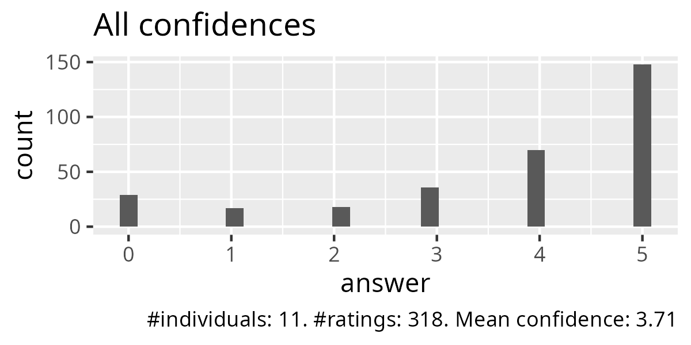
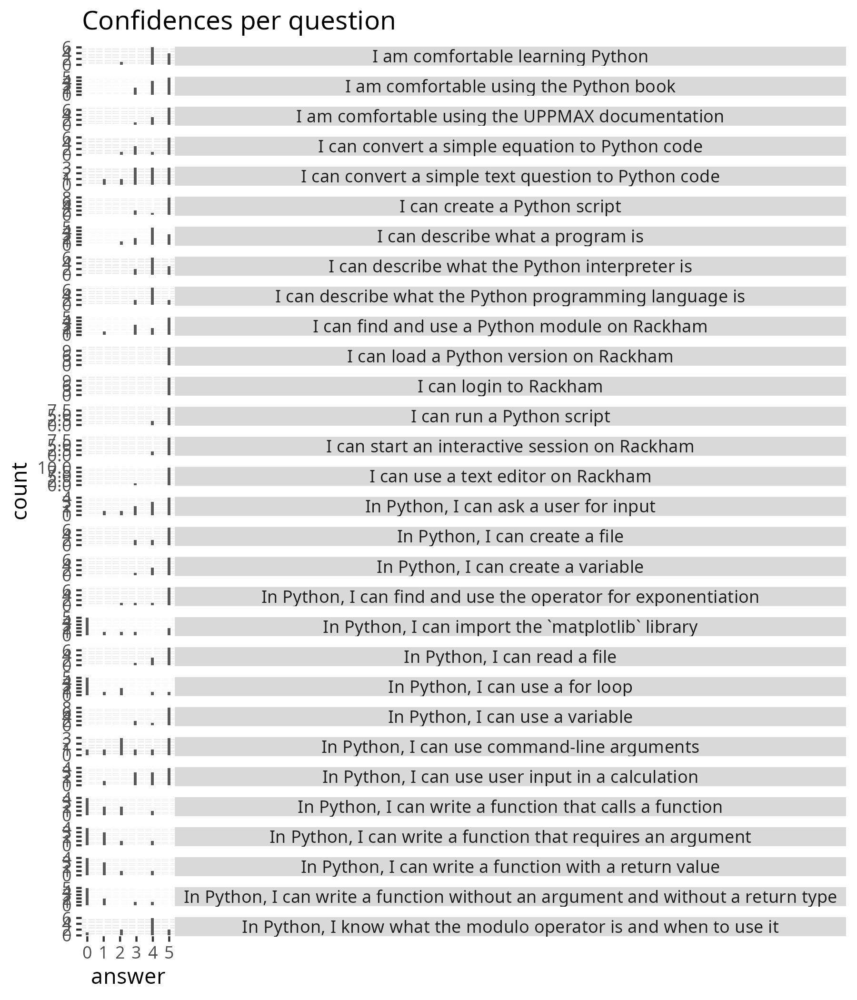

# Evaluation

## Anonymous feedback

From [anonymous_feedback.txt](anonymous_feedback.txt):

Loved the organisation, very well prepared course! Richel is the best.

## Survey feedback

From [survey_feedback.txt](survey_feedback.txt):

- Great course. Now, Python is not scary anymore.
- Thanks for the class today! It was very well organized and I really appreciated your energy. I feel like maybe some things were a little basic for me and I wish we had gotten into the more advanced stuff at the end. But this really reinforced the basics for me and I'm still glad that I did it.
- Thank you for creating very interactive calss room 
- I liked Ri-kjells teaching style!

## Scores

question|answer|n
---|---|---
I am comfortable learning Python|2|1
I am comfortable learning Python|4|6
I am comfortable learning Python|5|4
I am comfortable using the Python book|3|2
I am comfortable using the Python book|4|4
I am comfortable using the Python book|5|5
I am comfortable using the UPPMAX documentation|3|1
I am comfortable using the UPPMAX documentation|4|3
I am comfortable using the UPPMAX documentation|5|7
I can convert a simple equation to Python code|2|1
I can convert a simple equation to Python code|3|3
I can convert a simple equation to Python code|4|1
I can convert a simple equation to Python code|5|6
I can convert a simple text question to Python code|1|1
I can convert a simple text question to Python code|2|1
I can convert a simple text question to Python code|3|3
I can convert a simple text question to Python code|4|3
I can convert a simple text question to Python code|5|3
I can create a Python script|3|2
I can create a Python script|4|1
I can create a Python script|5|8
I can describe what a program is|2|1
I can describe what a program is|3|2
I can describe what a program is|4|5
I can describe what a program is|5|3
I can describe what the Python interpreter is|3|2
I can describe what the Python interpreter is|4|6
I can describe what the Python interpreter is|5|3
I can describe what the Python programming language is|3|2
I can describe what the Python programming language is|4|7
I can describe what the Python programming language is|5|2
I can find and use a Python module on Rackham|1|1
I can find and use a Python module on Rackham|3|3
I can find and use a Python module on Rackham|4|2
I can find and use a Python module on Rackham|5|5
I can load a Python version on Rackham|5|11
I can login to Rackham|5|11
I can run a Python script|4|2
I can run a Python script|5|9
I can start an interactive session on Rackham|4|2
I can start an interactive session on Rackham|5|9
I can use a text editor on Rackham|3|1
I can use a text editor on Rackham|5|10
In Python| I can ask a user for input|1|1
In Python| I can ask a user for input|2|1
In Python| I can ask a user for input|3|2
In Python| I can ask a user for input|4|3
In Python| I can ask a user for input|5|4
In Python| I can create a file|3|2
In Python| I can create a file|4|2
In Python| I can create a file|5|7
In Python| I can create a variable|3|1
In Python| I can create a variable|4|3
In Python| I can create a variable|5|7
In Python| I can find and use the operator for exponentiation|2|1
In Python| I can find and use the operator for exponentiation|3|1
In Python| I can find and use the operator for exponentiation|4|1
In Python| I can find and use the operator for exponentiation|5|7
In Python| I can find and use the operator for exponentiation|NA|1
In Python| I can import the `matplotlib` library|0|5
In Python| I can import the `matplotlib` library|1|1
In Python| I can import the `matplotlib` library|2|1
In Python| I can import the `matplotlib` library|3|1
In Python| I can import the `matplotlib` library|5|2
In Python| I can import the `matplotlib` library|NA|1
In Python| I can read a file|3|1
In Python| I can read a file|4|3
In Python| I can read a file|5|7
In Python| I can use a for loop|0|5
In Python| I can use a for loop|1|1
In Python| I can use a for loop|2|2
In Python| I can use a for loop|4|1
In Python| I can use a for loop|5|1
In Python| I can use a for loop|NA|1
In Python| I can use a variable|3|2
In Python| I can use a variable|4|1
In Python| I can use a variable|5|8
In Python| I can use command-line arguments|0|1
In Python| I can use command-line arguments|1|1
In Python| I can use command-line arguments|2|3
In Python| I can use command-line arguments|3|1
In Python| I can use command-line arguments|4|1
In Python| I can use command-line arguments|5|3
In Python| I can use command-line arguments|NA|1
In Python| I can use user input in a calculation|1|1
In Python| I can use user input in a calculation|3|3
In Python| I can use user input in a calculation|4|3
In Python| I can use user input in a calculation|5|4
In Python| I can write a function that calls a function|0|4
In Python| I can write a function that calls a function|1|2
In Python| I can write a function that calls a function|2|2
In Python| I can write a function that calls a function|4|1
In Python| I can write a function that calls a function|NA|2
In Python| I can write a function that requires an argument|0|4
In Python| I can write a function that requires an argument|1|3
In Python| I can write a function that requires an argument|2|1
In Python| I can write a function that requires an argument|4|1
In Python| I can write a function that requires an argument|NA|2
In Python| I can write a function with a return value|0|4
In Python| I can write a function with a return value|1|3
In Python| I can write a function with a return value|2|1
In Python| I can write a function with a return value|4|1
In Python| I can write a function with a return value|NA|2
In Python| I can write a function without an argument and without a return type|0|5
In Python| I can write a function without an argument and without a return type|1|2
In Python| I can write a function without an argument and without a return type|3|1
In Python| I can write a function without an argument and without a return type|4|1
In Python| I can write a function without an argument and without a return type|NA|2
In Python| I know what the modulo operator is and when to use it|0|1
In Python| I know what the modulo operator is and when to use it|2|2
In Python| I know what the modulo operator is and when to use it|4|6
In Python| I know what the modulo operator is and when to use it|5|2

