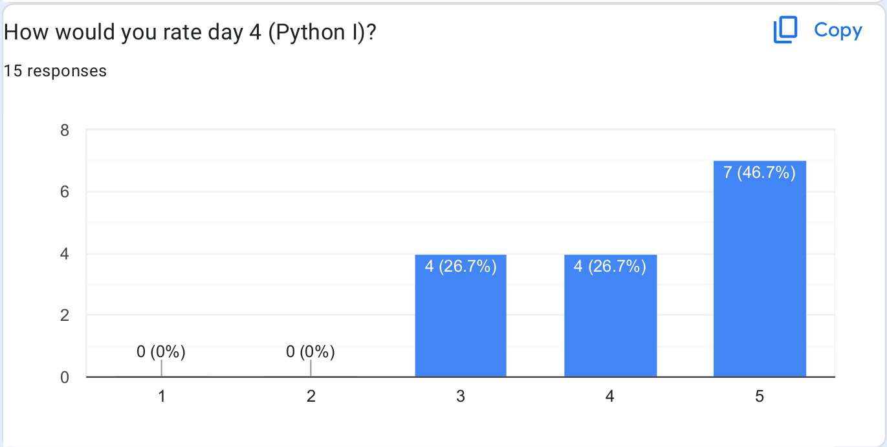
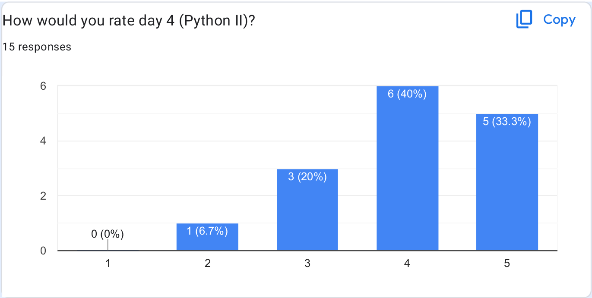

# 2024 January

* Teacher: Richel
* Day 4: Python I and Python II

These are the anonymous evaluation results that clearly apply to me.

Note that I am the only instructor that got a 2 out of 5.

## What did you like the most about the course?

> This fulfilled all of my requirements as a beginner to Uppmax and basic
> coding in BASH. I liked
> the hands-on nature of the activities, especially with Richel.
> Although it was intense and tiring,
> it forced effective learning

This is great to hear! This was the whole idea: we know that learners
prefer a passive lecture over active teaching, even though they learn less.

## What did you like the least about the course?

> At the Python section, i didn't like that we skipped some of the solutions.
> After trying out and
> failing i would like to see at least how to solve it,
> and we lost a lot of time on some of the
> easier exercises.

I agree with the learner that at the end of the day, I started skipping things.
I did so purposefully, yet I did not expect this was problematic enough to
end up on an evaluation.

> Python scripts part

Too bad that there is no reason here...

## How do you think we could improve the course (on e.g. topics covered, materials, exercises, course structure, length, announcement, registration, etc.)?

> more paired up exercises

I was the only instructor that did this. I am happy at least one learner liked it :-)

## Do you have any additional comments or suggestions?

> I liked the course overall, however Python may need its own course,
> because it couldn't cover
> much because of short time, and the exercises skipped
> from basic stuff to intermediate pretty
> quick at least for me as a person who didn't work with python before.

I wonder where that quick skip from basic to intermediate happened.
I'd guess at file IO, which indeed is a jump from book chapter 3 to chapter 13.
Next time, I should invest some time in bridging this gap.

> For the Python session in the last day, we got a lot of practice time
> but time was much behind
> the schedule. I was also stuck with some errors.
> I suggest intead of only two students in a
> break room, assign more students in a room and the questions
> are likely be solved. Teacher
> show also provide correct answers after practice.

This is a new insight, that if a course is learner-centered (i.e.
the pace is determined by the learners) and the schedule is not completed,
this may give a negative effect. I will reshape the schedule to help
learners get the opposite effect.

I am unsure about using more than two learners: in the end, learners that have
finished an exercise were sent to help, hence rooms would fill up to three or
four learners.

Indeed, here too, in the end I cut corners in not showing the answers on
purpose. It is a more sensitive matter than I thought :-)
